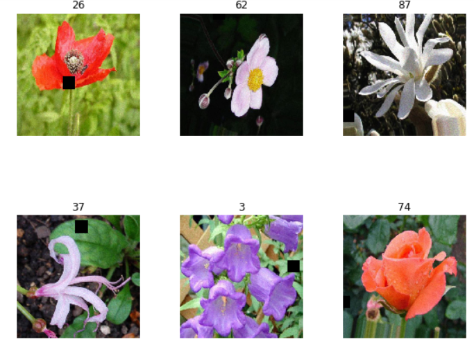

# Hacker Earth Garden Nerd Data Science Competition


## Dataset

The data folder consists of 2 folders and 3 CSV files:

* train - Contains 18540 images from 102 categories of flowers
* test  - Contains 2009 images
* train.csv - Contains 2 columns and 18541 rows (including the headers), which consists of image id and the true label for each of the images in the train folder
* test.csv - Contains the ```image id``` for the images present in test folder for which the true label needs to be predicted
```sample_submission.csv``` - Specifies the format for the submission file

For more information on type of flowers provided as input you can visit [here](https://www.hackerearth.com/challenges/competitive/garden-nerd-data-science-competition/machine-learning/flower-recognition/) with valid hackerearth account. One can download the dataset from [here](https://he-public-data.s3-ap-southeast-1.amazonaws.com/HE_Challenge_data.zip).

Here are some of the sample images from the dataset:




## Dependencies

The dependencies to run this code are:


*   [Numpy](https://pypi.org/project/numpy/)      
*   [Pandas](https://pypi.org/project/pandas/)
*   [Pretrainedmodels](https://pypi.org/project/pretrainedmodels/)
*   [PyTorch](https://pytorch.org/)
*   [Fastai](https://www.fast.ai/)

## Pre-Processing

Please follow notebooks to get information on the preprocessing done on images before training the model


## Model

[Transfer learning](https://en.wikipedia.org/wiki/Transfer_learning) is a technique to use a model *learned* on one problem to apply it to  similar problem. We can efficiently achieve state-of-the-art results in short span of time. Special props to [@rednivrug](https://github.com/lucky630) for providing the baseline. 
The final solution is an ensemble of three architectures of popular
1. ResNet
2. DenseNet

more information is given in the code

## Training 

To train the model, you can run
```bash
./src/code_HE_Train.ipynb
```
Edit the path to load the dataset and save the weights

## Testing 

For just testing the code, run 
```bash
./src/code_HE_Train.ipynb
```
Download the weights from the link given in the notebook and edit the path to load them

## Note
I was able to achieve rank of 18 out of 7620 users taking part in this competition with an accuracy of 89.99390 in just 5 days. This demonstrates the power of ensemble learning. One will have to re-train ```learn``` and ```learn2``` models to get the final result.
